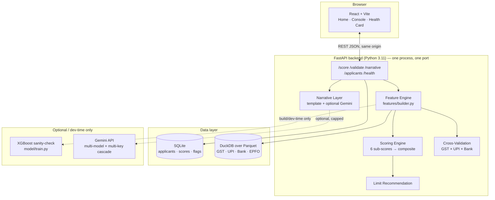
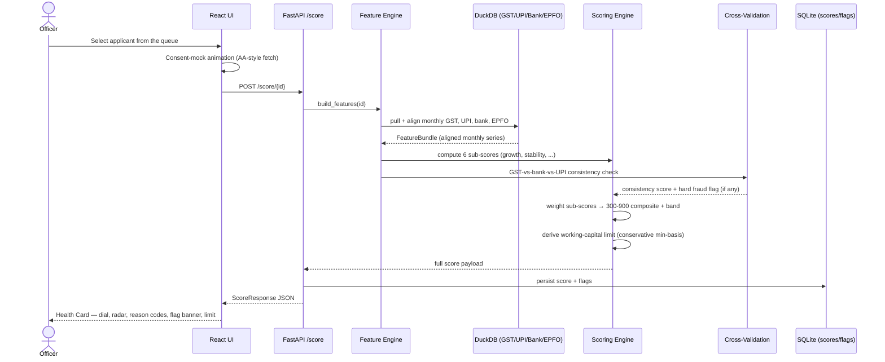

# SETU Score — MSME Financial Health Card

A credit-invisible-MSME scoring POC that aggregates
GST returns, UPI settlement flows, bank statements, and EPFO payroll into an
explainable 0–900 **SETU Score**, a six-axis risk radar, cross-source fraud
validation, and a conservative working-capital limit recommendation — served as a
LOS-ready JSON API behind a live Cloud Run link, with a landing page, an officer
console, and a Health Card UI in front of it.

> **All data in this repository is synthetic**, seeded and generated by
> [`datagen/generate.py`](datagen/generate.py). Every score, flag, and limit shown in
> the UI or API is computed live, at request time, by code in this repo — nothing is
> hard-coded or pre-baked. See [Limitations](#limitations) for exactly what that
> does and doesn't prove.

**Live demo:** https://setu-score-229692962627.asia-south1.run.app

**Demo Video:** https://drive.google.com/drive/folders/12wzXLsdcdSuMtblY_t7Io-WKIj52qJ0a?usp=sharing

---

## Contents

- [Setup & running locally](#setup--running-locally)
- [Folder structure](#folder-structure)
- [Architecture diagram](#architecture-diagram)
- [Process flow diagram](#process-flow-diagram)
- [Scoring methodology](#scoring-methodology)
- [API contract](#api-contract)
- [Optional Gemini narrative](#optional-gemini-narrative)
- [Testing](#testing)
- [Deployment (Cloud Run)](#deployment-cloud-run)
- [Limitations](#limitations)

---

## Setup & running locally

### Prerequisites

| Tool | Version | Needed for |
|---|---|---|
| Python | 3.11+ | backend, datagen, model |
| Node.js | 20+ | frontend |
| Docker (optional) | any recent | one-command `docker compose up` |
| `gcloud` CLI (optional) | any recent | only for redeploying to Cloud Run |

No cloud account, API key, or credential is required for local development — the
entire system (data generation, scoring, the optional ML layer, and the UI) runs
offline.

### Option A — one command via Docker

```bash
docker compose up --build
```

Open **http://localhost:8000**. One container serves both the API and the built
React UI from the same origin. `.env` is optional — copy `.env.example` if you want
to try the optional Gemini narrative locally; every other feature works with zero
keys.

### Option B — local dev, two terminals (hot reload)

```bash
# 1. Install Python deps and generate + validate the synthetic dataset
#    (deterministic, seeded, ~2 seconds)
pip install -r requirements.txt
python -m datagen.generate
python -m datagen.validate_data

# 2. Start the backend (terminal 1)
uvicorn backend.app.main:app --reload --port 8000

# 3. Start the frontend (terminal 2)
cd frontend
npm install
npm run dev
# → http://localhost:5173, Vite proxies /score /applicants /validate /... to :8000
```

`make` targets (`data`, `train`, `test`, `demo`, `deploy`) wrap the commands above.
On Windows or any box without `make`, just run the underlying command shown next to
each target in `Makefile` directly (e.g. `make data` ⇔
`python -m datagen.generate && python -m datagen.validate_data`).

### Optional: train the ML sanity-check model

```bash
python -m model.train   # writes model/model.pkl + model/metrics.json
```

Skippable — the served API never depends on this; see
[Scoring methodology](#scoring-methodology).

---

## Folder structure

```
setu-score/
├── README.md                    # this file
├── Makefile                     # make data / train / test / demo / deploy
├── docker-compose.yml           # one-command local stack
├── Dockerfile                   # multi-stage: build frontend → bake data → serve
├── requirements.txt             # full dev dependency set
├── requirements-runtime.txt     # slim set actually installed in the Docker image
├── .env.example                 # env template (copy to .env, never commit .env)
│
├── backend/
│   ├── app/
│   │   ├── main.py              # FastAPI app factory + all routes
│   │   ├── config.py            # RANDOM_SEED, paths, scoring weights, feature flags
│   │   ├── schemas.py           # pydantic models — the frozen API contract
│   │   ├── format_shared.py     # small server-side formatting helpers (₹, labels)
│   │   ├── repository/          # DB-access interfaces (SQLite/DuckDB today);
│   │   │                        #   the swap-point for a future BigQuery/Firestore move
│   │   ├── features/            # builds the aligned per-applicant FeatureBundle
│   │   ├── scoring/
│   │   │   ├── subscores.py     # 6 sub-score calculators (pure functions)
│   │   │   ├── composite.py     # weighting → 0–900 composite + band
│   │   │   ├── limits.py        # working-capital limit recommendation
│   │   │   └── pipeline.py      # orchestrates the above into one API payload
│   │   ├── validation/
│   │   │   └── cross_checks.py  # GST × UPI × bank fraud-consistency engine
│   │   └── narrative/
│   │       ├── templates.py     # deterministic reason-code narrative (default)
│   │       ├── gemini.py        # optional LLM polish, multi-model × multi-key cascade
│   │       └── usage_store.py   # SQLite-persisted Gemini call counter (hard-capped)
│   └── tests/                   # pytest — one file per module above, plus:
│       ├── golden/              # frozen example API responses (contract tests)
│       ├── test_e2e_personas.py # scores all 60 seeded MSMEs, asserts band separation
│       └── test_api.py          # route-level tests incl. the golden-contract check
│
├── datagen/
│   ├── personas.py              # 6 persona definitions as dataclasses (no magic numbers)
│   ├── generate.py              # seeded generator → parquet + sqlite seed
│   └── validate_data.py         # 13 data-invariant checks (run in `make data`)
│
├── frontend/
│   └── src/
│       ├── App.tsx              # top-level view/nav state machine
│       ├── api.ts               # typed fetch client mirroring schemas.py
│       ├── pages/
│       │   ├── Home.tsx         # landing page — problem, solution, tech, footer CTA
│       │   ├── Console.tsx      # officer console — applicant queue
│       │   └── HealthCard.tsx   # score detail — dial, radar, reason codes, trend
│       └── components/          # ScoreDial, RiskRadar, TrendChart, FlagBanner,
│                                 #   ReasonCodes, ConsentModal, Footer
│
├── model/
│   ├── train.py                 # optional XGBoost sanity-check ranker (temporal split)
│   └── metrics.json             # produced by train.py — never hand-edited
│
└── deploy/
    └── cloudrun.md               # gcloud deploy commands, current live URL, cost note
```

---

## Architecture diagram



One Docker image, one Cloud Run service: the same FastAPI process serves the JSON
API and the built React static files — no CORS setup, no separate frontend hosting
(see [`Dockerfile`](Dockerfile)).

---

## Process flow diagram

What happens end-to-end when an officer scores an applicant (`POST /score/{id}`,
[`scoring/pipeline.py`](backend/app/scoring/pipeline.py)):



If cross-validation raises a hard flag (systematic GST over-declaration vs observed
bank/UPI inflows), the composite is capped at 449, the recommendation forces
`REFER_FRAUD_REVIEW`, and the limit is withheld — regardless of how healthy the six
sub-scores look in isolation.

---

## Scoring methodology

**Six sub-scores** (each 0–100, pure functions in
[`scoring/subscores.py`](backend/app/scoring/subscores.py)), weighted into a
300–900 composite:

| Sub-score | Weight | What it measures |
|---|---|---|
| Growth | 15% | Blended (GST + bank) turnover trend, year-over-year where 24 months of history exist |
| Cash-flow Stability | 20% | Coefficient of variation of monthly net inflows, penalising negative-net months |
| Compliance Discipline | 15% | GST + EPFO on-time filing percentage |
| Liquidity | 20% | Trailing cash level **and** its drawdown trend vs fixed monthly obligations |
| Customer Concentration | 15% | Herfindahl index over UPI payer distribution |
| Leverage | 15% | Existing EMI outflow ÷ average monthly inflow (FOIR-like) |

Weights sum to 1.0 (asserted at import time in `config.py`); each carries a one-line
rationale in code. Bands: **< 450 High Risk · 450–600 Watch · 600–750 Good · ≥ 750
Excellent**. A thin-file applicant's composite is additionally blended toward a
neutral prior in proportion to missing history — the "shorter-history caveat", not a
hidden penalty.

**Cross-source fraud validation**
([`validation/cross_checks.py`](backend/app/validation/cross_checks.py)): compares
declared GST turnover against observed bank credits (±25% per-quarter tolerance) and
UPI settlement volume, plus a round-number filing detector. A systematic GST
over-declaration is a **hard flag** — it caps the composite at 449 and forces
`REFER_FRAUD_REVIEW`, regardless of how healthy the six sub-scores look in isolation.

**Working-capital limit**
([`scoring/limits.py`](backend/app/scoring/limits.py)):

```
limit = clamp(6 × avg_verified_monthly_net_inflow × stability_multiplier, caps)
```

where verified inflow is `min(GST-declared, bank-observed)` for every month —
conservative by construction, so an inflated GST filing can never inflate the limit.

**Optional ML sanity-check** ([`model/train.py`](model/train.py), skippable): a small
XGBoost classifier trained on the six sub-scores — recomputed on a truncated
first-18-months window — predicting the persona-implied risk bucket. As of the last
`python -m model.train` run: **86.7% agreement** on a 15-sample held-out split
(`model/metrics.json`, never hand-edited). This is a feature-sanity check on 50
synthetic samples, shown in any demo as *"model agreement"* — never as a real-world
accuracy claim. Notably, sub-scores alone caught the fraud persona on this run too
(`fraud_persona_recall_in_test: 1.0`) — but that coverage is **incidental**, not
guaranteed the way `cross_checks.py` is (which deterministically flags 100% of the
fraud persona by construction, verified in `test_cross_checks.py`). Fraud review
decisions always route through `cross_checks.py`, never through this model.

---

## API contract

`GET /applicants` → officer queue. `POST /score/{id}` → runs the full pipeline:

```json
{
  "applicant_id": "MSME-0001",
  "setu_score": 809,
  "band": "EXCELLENT",
  "sub_scores": {"growth": 100, "stability": 49, "compliance": 99,
                 "liquidity": 100, "concentration": 92, "leverage": 84},
  "reason_codes": [{"code": "...", "direction": "...", "evidence": "..."}],
  "cross_validation": {"consistency_score": 100, "flags": [...]},
  "limit_recommendation": {"amount_inr": 1360000, "tenor_months": 12, "basis": "..."},
  "recommendation": "APPROVE_WITH_LIMIT",
  "data_source": "synthetic",
  "scored_at": "..."
}
```

This exact shape is frozen and pinned by golden-response tests in
[`backend/tests/golden/`](backend/tests/golden/) — any silent drift fails CI.
`GET /applicants/{id}/trend`, `POST /validate/{id}`, and `POST /narrative/{id}`
are additive endpoints layered on top; they never touch this contract.

---

## Optional Gemini narrative

Default path is fully deterministic (`narrative/templates.py`) — the demo works with
zero API keys. If `ENABLE_LLM_NARRATIVE=true` and at least one Gemini key is set,
`POST /narrative/{id}` polishes the template into fluent prose using **only the
already-computed aggregates** (band, sub-scores, reason codes, cross-validation
flags, limit) — never raw GST/UPI/bank/EPFO rows.

**Multi-model × multi-key cascade** ([`narrative/gemini.py`](backend/app/narrative/gemini.py)):
for each API key (`GEMINI_API_KEY` then `GEMINI_API_KEY_FALLBACK`), the code tries
every model in an ordered cascade (`gemini-flash-latest` → 3 → 2.5 → 2.0 → 1.5
family) until one returns usable text. A model that's exhausted, retired, or doesn't
exist on the account just errors and the cascade moves to the next candidate — only
once *every* model has failed on *every* key does it fall back to the template.

A single SQLite-persisted counter hard-caps the whole cascade at **50 raw API
calls total**, surviving process restarts (durable, not a per-boot allowance), with
a max of 1,000 output tokens/call. Once the cap is hit, the function is a silent
no-op returning the template. Worst case at free-tier AI Studio rates: ₹0. Even at
paid rates this stays comfortably under the ₹300 POC budget cap. `ENABLE_LLM_NARRATIVE`
defaults to `false` on the deployed Cloud Run link, so the public demo needs no key
at all — flip it on temporarily for a live walkthrough if you want the polish shown.

---

## Testing

```bash
python -m datagen.validate_data   # 13 data invariant checks
python -m pytest                  # backend unit + API + golden-contract + e2e tests
cd frontend && npm run typecheck && npm run test   # frontend
```

As of this commit: **13/13** data invariants, **80** backend pytest cases, **6**
frontend render tests — all green. The end-to-end smoke test
([`test_e2e_personas.py`](backend/tests/test_e2e_personas.py)) scores all 60 seeded
MSMEs and asserts each of the six personas lands in its expected band with clean
`EXCELLENT > GOOD > WATCH > fraud(capped)` separation — our honest "the pipeline
rank-orders correctly on seeded personas" proof, **not** a real-world accuracy claim.

---

## Deployment (Cloud Run)

See
[`deploy/cloudrun.md`](deploy/cloudrun.md) for the exact commands (also runnable via
`make deploy`). Architecture: one multi-stage `Dockerfile` bakes the synthetic
dataset in at build time (read-only at runtime), `min-instances=0` /
`max-instances=1` so it scales to zero between visits and costs nothing when idle.

**Live URL:** https://setu-score-229692962627.asia-south1.run.app

Post-deploy smoke test: `GET /health`, `GET /applicants`, and `POST /score/MSME-0001`
were verified against the live URL — the score response is a **byte-exact match**
(fields other than `scored_at`) against
[`backend/tests/golden/score_healthy_growth.json`](backend/tests/golden/score_healthy_growth.json).
Cost: within the Cloud Run always-free tier (`min-instances=0`, a handful of smoke
requests) — expected ₹0; see [`deploy/cloudrun.md`](deploy/cloudrun.md) for the note
on confirming the exact figure in the GCP billing console once it settles.

---

## Limitations

Read this section before treating any number here as more than it is.

- **All data is synthetic**, generated by a seeded Python script
  (`datagen/personas.py` + `datagen/generate.py`) to tell six specific stories. It is
  *not* sampled from real MSME financial behaviour. Realistic magnitudes and
  correlations were hand-tuned to be plausible, not empirically validated.
- **60 firms, 6 personas** is nowhere near enough for statistically meaningful
  model evaluation. The 86.7% "model agreement" figure is computed on a 15-sample
  held-out split of synthetic, persona-labelled data — it demonstrates the six
  engineered features carry separable signal, nothing more.
- **Sub-score weights and thresholds are hand-set with a one-line rationale each**,
  not learned from outcome data (there is no real repayment-outcome data to learn
  from). They are a reasonable, explainable starting point — not a calibrated risk
  model.
- **No real AA/GSTN/EPFO/OCEN integration.** The consent flow shown in the UI is a
  mock returning synthetic payloads after a simulated consent step; swapping in real
  AA/GSTN endpoints changes only the connector layer, not the scoring code.
- **No authentication, authorization, multi-tenancy, or audit logging** beyond basic
  request handling — explicitly out of scope for this POC (see `CLAUDE.md` §10).
- **The optional ML layer is a feature sanity-check, not a decisioning model** — see
  [Scoring methodology](#scoring-methodology). Fraud decisions never route through it.
- **Cross-validation tolerances (±25% GST-vs-bank, etc.) are POC defaults**, not
  derived from a fraud-loss study.
- **The demo is honestly framed throughout** as "rank-orders correctly on seeded
  personas" — never as a real-world accuracy or fraud-detection-rate claim. If a
  metric looks weak anywhere in this repo, the fix path is noted next to it rather
  than hidden.

---

Built by **[Darshan Bhavsar](https://www.linkedin.com/in/darshan01/)**.
